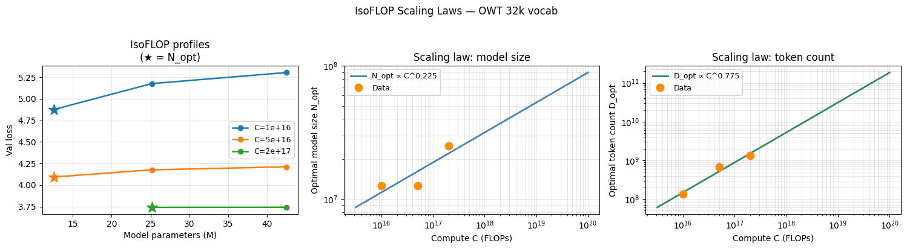

# LLM Scaling Laws from Scratch

> I didn't just build a transformer — I ran the Chinchilla isoFLOP experiments from scratch and fit my own scaling laws. My data says the compute-optimal split is **N_opt ∝ C^0.225**, not C^0.50. Here's everything, in pure PyTorch, no black boxes.



*Three compute budgets (10^16–2×10^17 FLOPs), 8 training runs, power-law fits for N_opt and D_opt.*

[](https://colab.research.google.com/github/kpal002/transformer-lm-from-scratch/blob/main/transformer_lm/notebooks/transformer_from_scratch.ipynb)


---

## What's inside

Everything is hand-coded — no HuggingFace, no `trl`, no shortcuts.

| Component | What's from scratch |
|---|---|
| **BPE Tokenizer** | Byte-pair encoding trainer + encoder with O(n log n) priority-queue merge and LRU word cache |
| **Transformer LM** | RoPE · RMSNorm · SwiGLU · pre-norm · causal attention — the same building blocks as Llama |
| **Optimizer** | AdamW with decoupled weight decay |
| **LR Schedule** | Cosine annealing with linear warmup (LLaMA-style) |
| **Training loop** | Gradient clipping · memmap data loading · W&B logging · checkpointing |
| **Ablations** | Four controlled experiments isolating RoPE, RMSNorm, SwiGLU, and pre-norm |
| **Scaling laws** | Model size sweep · vocab size sweep · token budget sweep · **isoFLOP / Chinchilla curves** |

---

## Scaling law results

I ran the Chinchilla isoFLOP protocol at three compute budgets on OpenWebText.

**IsoFLOP grid** (batch=128, context=512):

| Budget | Small (12.6M) | Medium (25.2M) | Large (42.5M) |
|---|---|---|---|
| C = 1×10¹⁶ | **loss 4.876** ← optimal | 5.176 | 5.305 |
| C = 5×10¹⁶ | **loss 4.092** ← optimal | 4.176 | 4.211 |
| C = 2×10¹⁷ | — | **loss 3.740** ← optimal | 3.742 |

**Power-law fits:**

```
N_opt  =  2796  × C^0.225    (Chinchilla: C^0.50)
D_opt  =  6e-5  × C^0.775    (Chinchilla: C^0.50)
```

At these compute scales, the data strongly favors smaller models trained on more tokens — a much steeper data-optimal regime than Chinchilla's 50/50 split. The exponent gap likely shrinks at larger C; reproducing the crossover is on the roadmap.

---

## Architecture

```
TransformerLM
├── Embedding(vocab_size, d_model)          ← no positional table
├── N × TransformerBlock
│   ├── RMSNorm → CausalMultiHeadSelfAttention (RoPE on Q/K)
│   └── RMSNorm → SwiGLUFFN
└── RMSNorm → Linear(d_model, vocab_size)
```

Default config (~17M params, trains in ~30 min on a free Colab T4):

```python
vocab_size     = 10_000   # from-scratch BPE on TinyStories
context_length = 256
d_model        = 512
num_layers     = 4
num_heads      = 16
d_ff           = 1344     # ceil(8/3 × 512 / 64) × 64  — SwiGLU param-equivalent
```

---

## Ablations

Four training runs on TinyStories (40M tokens, matched compute):

| Ablation | What changes | Expected effect |
|---|---|---|
| `baseline` | RoPE · RMSNorm · SwiGLU · pre-norm | — |
| `no_rmsnorm` | Remove normalization | Diverges or needs lower lr |
| `no_rope` | Learned position embeddings | Degrades on long sequences |
| `no_swiglu` | Replace with SiLU FFN | Slightly worse loss |
| `post_norm` | Move norm after residual | Less stable at high lr |

---

## Quick start

**Colab (recommended)** — click the badge above. The notebook runs top-to-bottom; each experiment section has a single variable to change (e.g. `ABLATION = "no_rope"`).

**Terminal:**

```bash
git clone https://github.com/kpal002/transformer-lm-from-scratch
cd transformer-lm-from-scratch
pip install -e .
```

```bash
# Step 1: train BPE tokenizer on TinyStories (~5 min)
python -m transformer_lm.scripts.train_tokenizer --vocab-size 10000 --output-dir ./run

# Step 2: train the model (downloads data, tokenizes, trains — ~30 min on T4)
python -m transformer_lm.scripts.train --out-dir ./run

# Step 3: generate text
python -m transformer_lm.scripts.generate \
    --checkpoint ./run/ckpt_final.pt \
    --vocab ./run/bpe.vocab --merges ./run/bpe.merges \
    --prompt "Once upon a time"
```

Common overrides:

```bash
# Larger model
python -m transformer_lm.scripts.train \
    --d-model 768 --num-layers 6 --num-heads 16 \
    --num-steps 10000 --out-dir ./run-large

# Resume from checkpoint
python -m transformer_lm.scripts.train --out-dir ./run --resume ./run/ckpt_005000.pt

# Multiple samples
python -m transformer_lm.scripts.generate ... --num-samples 5 --temperature 1.0
```

---

## Project structure

```
transformer_lm/
├── model/
│   ├── attention.py       # softmax, SDPA, RoPE, CausalMultiHeadSelfAttention
│   ├── ffn.py             # SwiGLUFFN
│   ├── layers.py          # Linear, Embedding, RMSNorm
│   └── transformer.py     # TransformerBlock, TransformerLM
├── tokenizer/
│   ├── trainer.py         # BPE training (O(n log n))
│   └── tokenizer.py       # BPETokenizer encode/decode
├── data/
│   └── tinystories.py     # TinyStories downloader
├── training/
│   ├── config.py          # TrainingConfig dataclass
│   ├── loss.py            # cross_entropy_loss (from scratch)
│   ├── optim.py           # AdamW + gradient clipping (from scratch)
│   ├── schedule.py        # cosine LR schedule with warmup
│   ├── data.py            # get_batch, tokenize_and_save
│   ├── checkpoint.py      # save/load checkpoint
│   └── trainer.py         # train(), generate()
└── scripts/
    ├── train_tokenizer.py # CLI: train BPE tokenizer
    ├── train.py           # CLI: train model end-to-end
    └── generate.py        # CLI: generate from checkpoint
```

---

## Roadmap

- [ ] KV cache for fast autoregressive generation
- [ ] SFT + GRPO — reasoning model training on GSM8K
- [ ] More compute budgets to close in on the Chinchilla crossover point

---

## References

- [Attention Is All You Need](https://arxiv.org/abs/1706.03762) — Vaswani et al., 2017
- [Training Compute-Optimal Large Language Models](https://arxiv.org/abs/2203.15556) — Hoffmann et al. (Chinchilla), 2022
- [LLaMA: Open and Efficient Foundation Language Models](https://arxiv.org/abs/2302.13971) — Touvron et al., 2023
- [RoFormer: Enhanced Transformer with Rotary Position Embedding](https://arxiv.org/abs/2104.09864) — Su et al., 2021
- Stanford CS336 — Language Modeling from Scratch
